Colocation algorithm
====================

For a given day, the colocation routine (``core_coloc``) matches each
Sentinel-1 WV OCN measurement with the altimeter observations closest in
space and time:

1. **SAR discovery** — glob the ESA Level-2 WV SAFE products
   (``<sat>_WV_OCN__2S/<year>/<doy>/*.SAFE``) for the day and load all
   ``measurement/*.nc`` files into a single xarray Dataset (``step_0``).
2. **Temporal pre-selection** — select altimeter files whose time coverage
   overlaps ``[D-1, D+1]`` around the SAR acquisition (``step_1``), then
   read them and build a scipy ``cKDTree`` of the altimeter tracks in
   3D (lat/lon converted to unit-sphere XYZ).
3. **Geographic matching** — for each WV measurement, keep altimeter points
   within ``delta_dist_km`` (Haversine distance) (``step_2``).
4. **Temporal matching** — among the geographic matches, keep points within
   ``delta_t_minutes`` of the WV measurement time (``step_3``).
5. **Merge & save** — merge the matched altimeter variables (e.g.
   ``swh_denoised`` for CCI, ``VAVH`` for CMEMS) with the WV variables into
   one Dataset and write the daily NetCDF plus a ``.lst`` file listing the
   altimeter files used per WV measurement.

The figures below illustrate the pipeline for the two altimeter sources
(CCI SeaState L2P and CMEMS WAVE L3 NRT).

CCI SeaState L2P
----------------

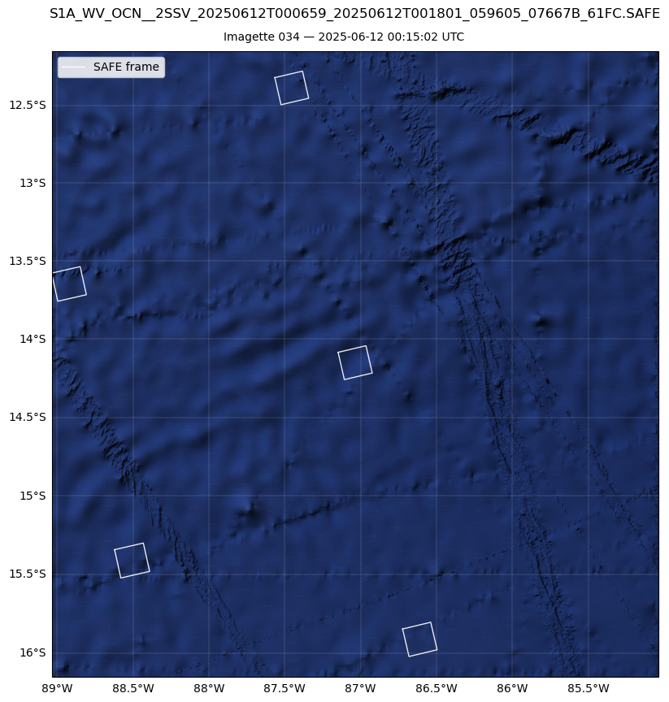

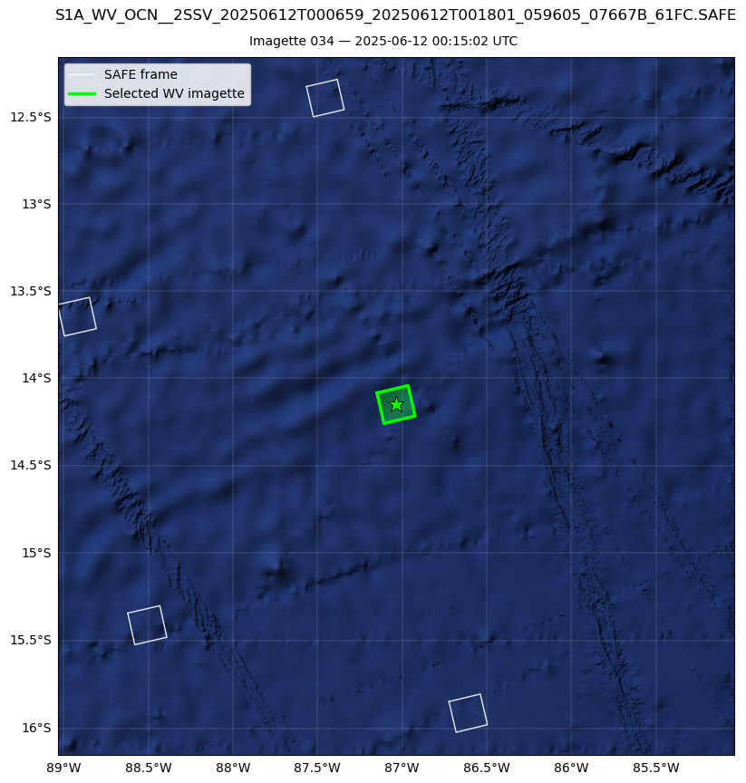

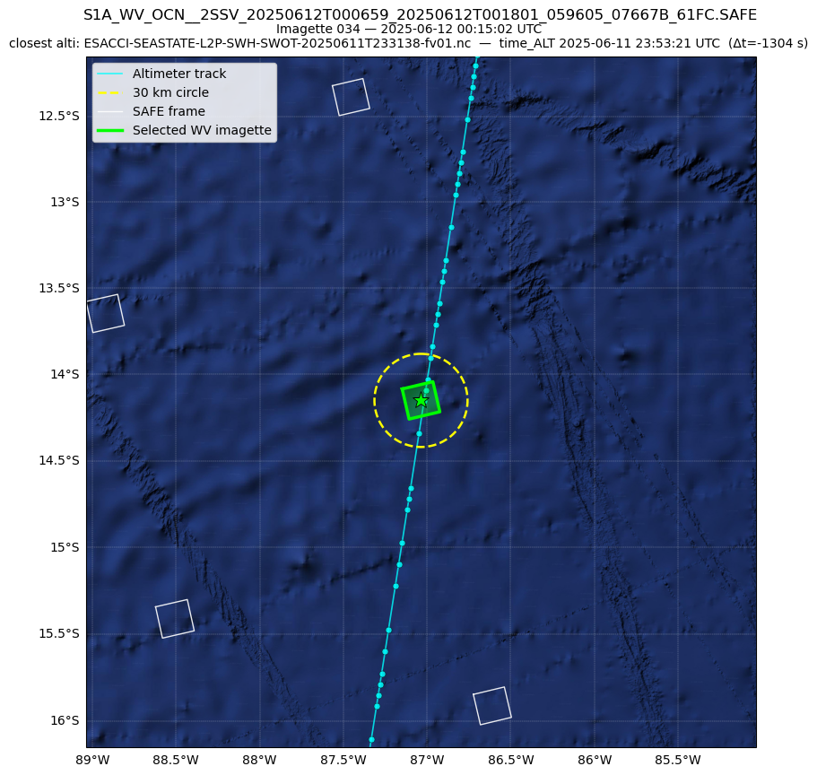

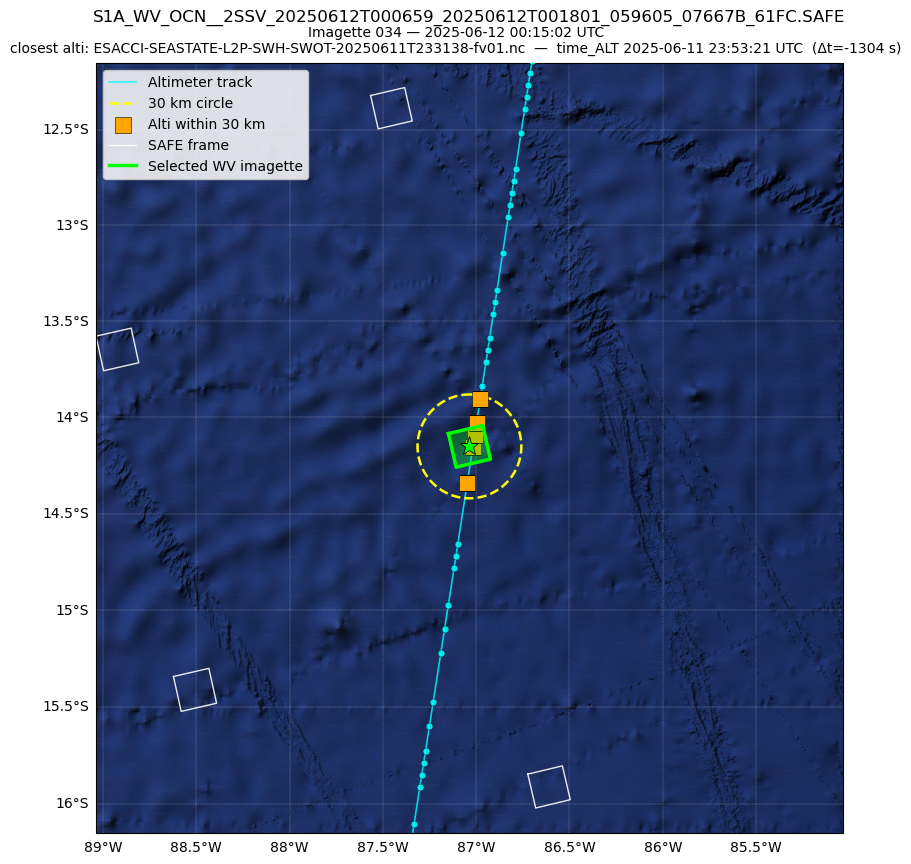

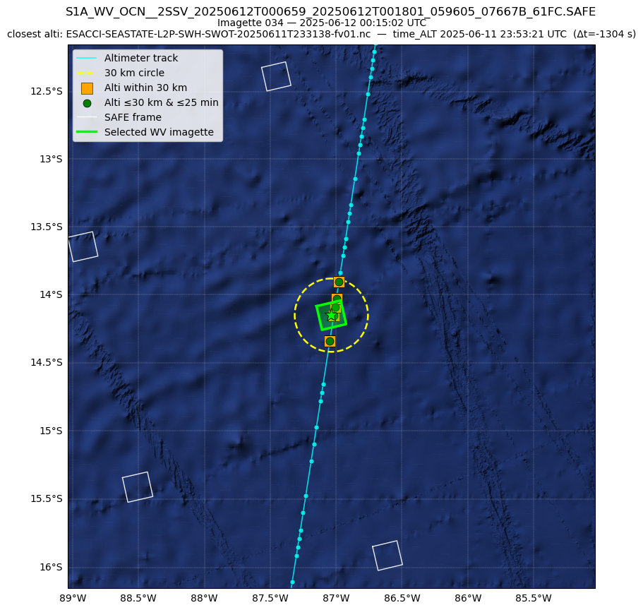

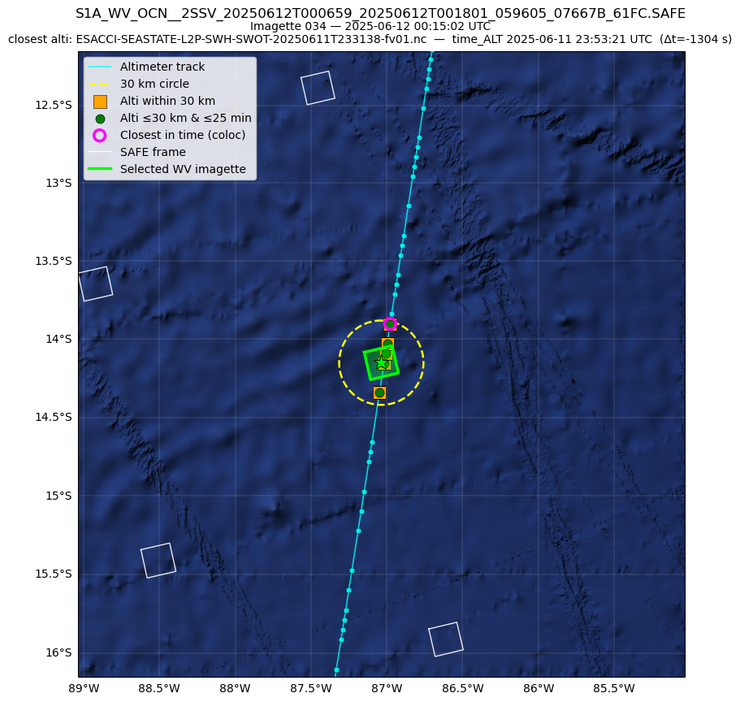

CMEMS WAVE L3 NRT
-----------------

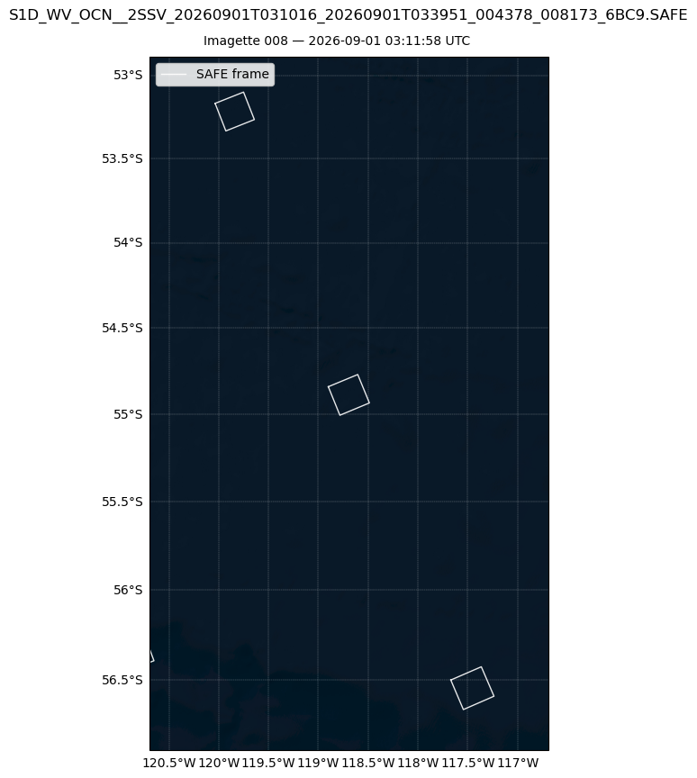

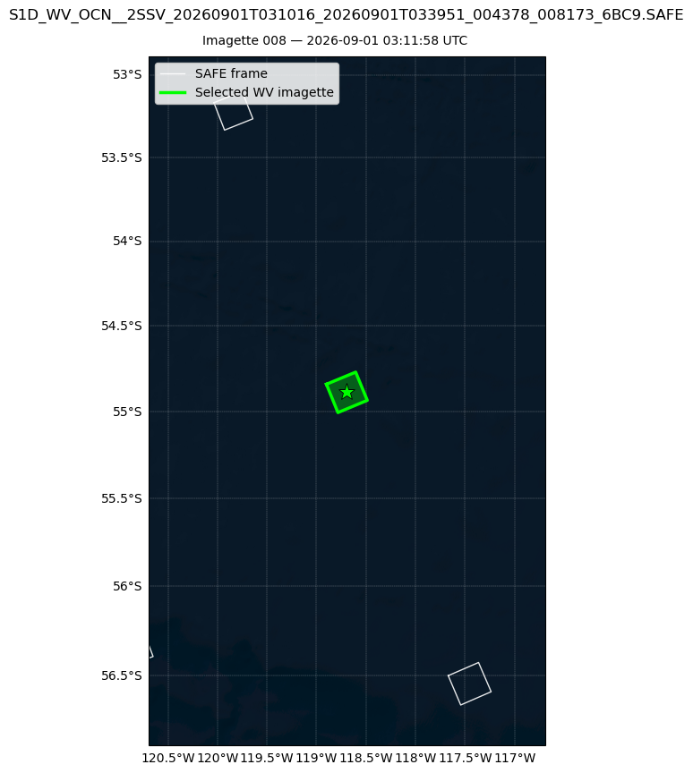

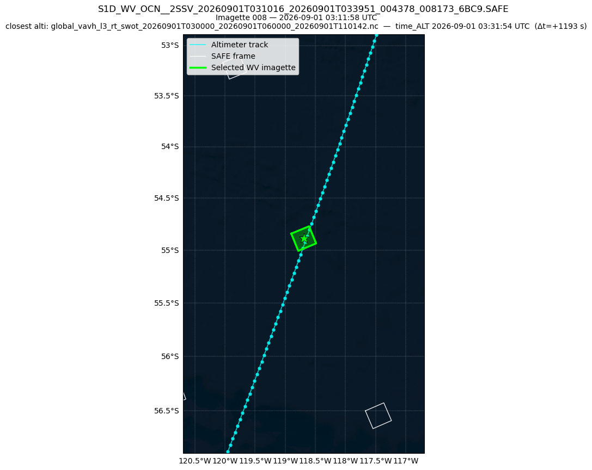

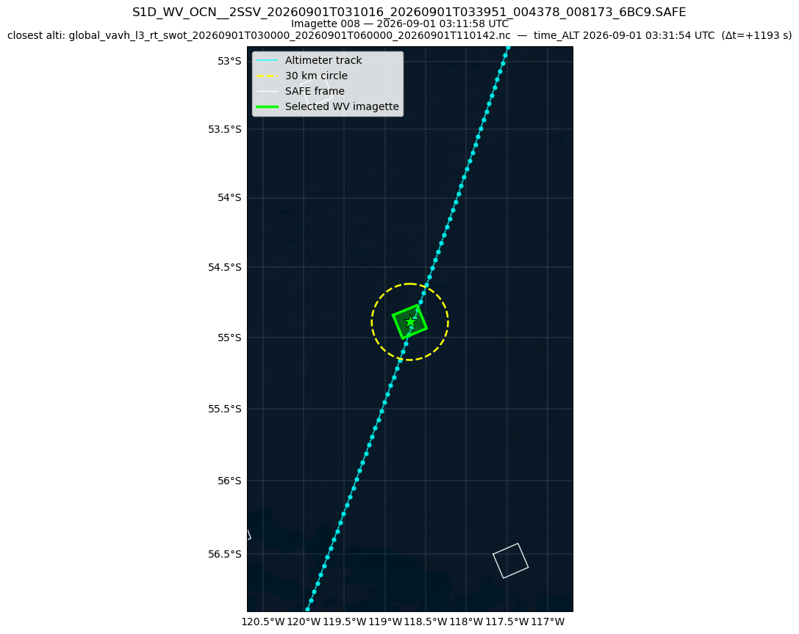

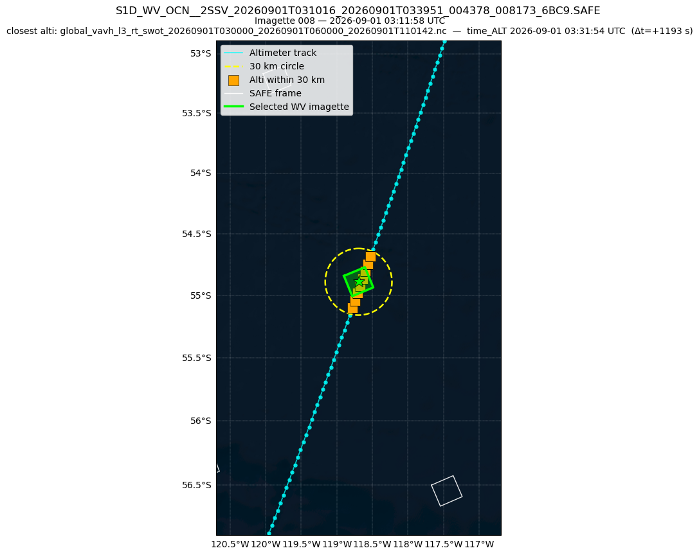

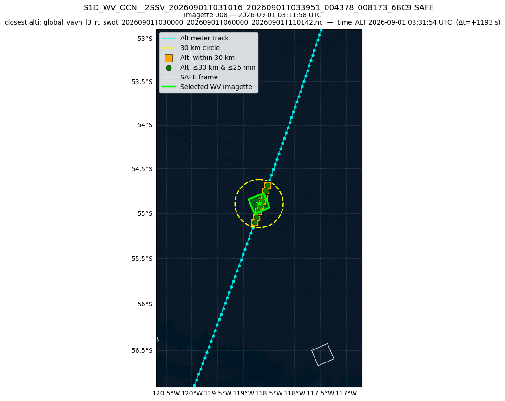

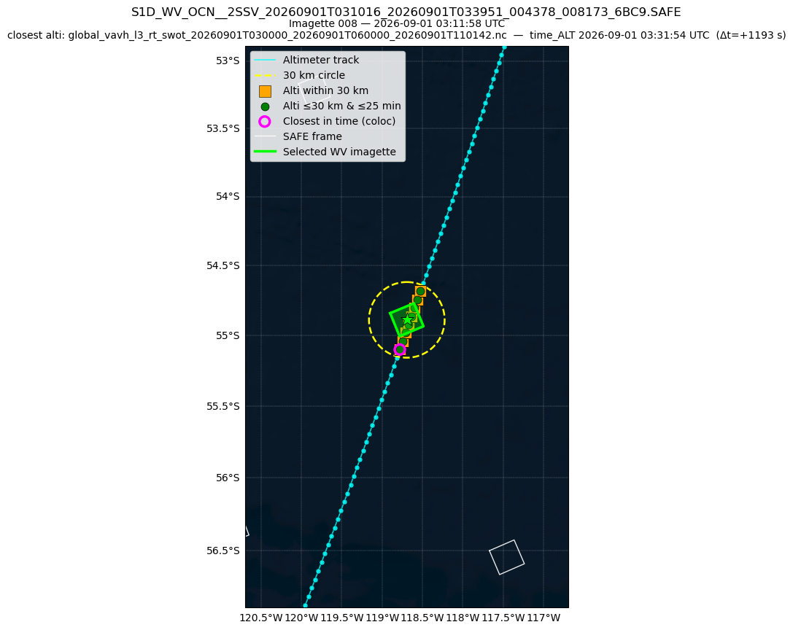
